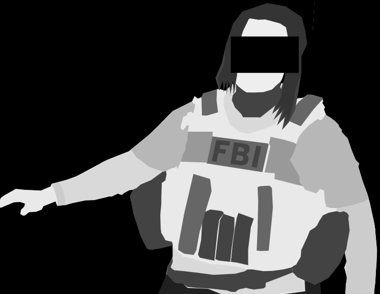
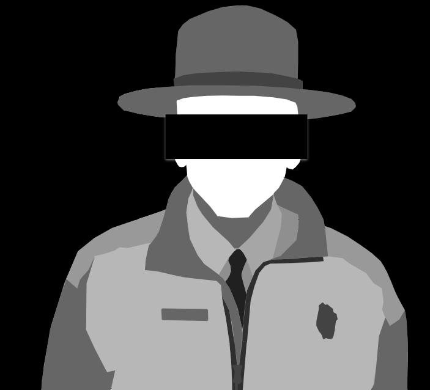
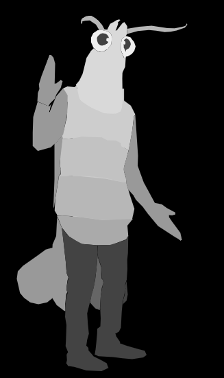
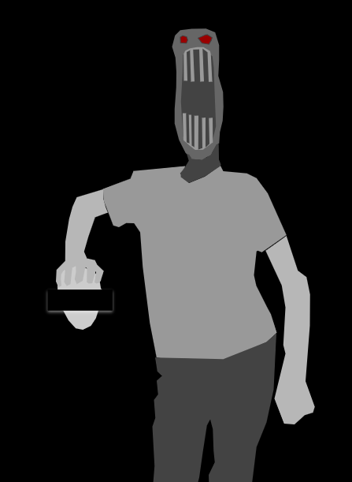
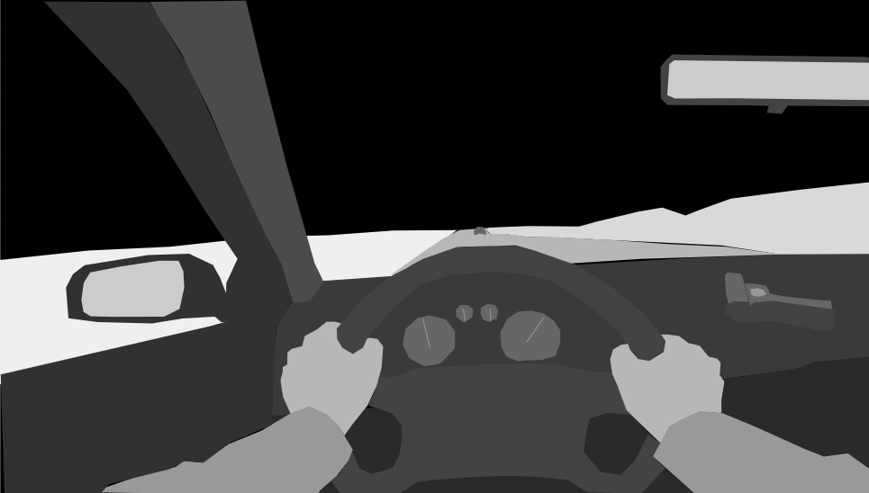

Generative AI was not used in the creative process. This is because I want this TTRPG to be an authentic, open experience. 

All drawings are created using [google draw](https://docs.google.com/drawings/). I usually take reference images, and then trace over them using polyline. This is because I possess no artistic skills whatsoever. Tracing over images using polyline has a similar difficulty level to coloring books, making it much more accessible to 

<style>
.my-row {
  display: flex;
  gap: 20px;
}

.my-col {
  flex : 1;
}

@media screen and (max-width: 767px) {
  .my-row {
    flex-direction: column; /* Stack items vertically on mobile */
  }
  img {
    max-width : 90%;
  }
}

</style>


## Artistic Drawings

<div class='my-row'>
  <div class='my-col'>
    <h3>Agent Cotton</h3>
   <p>Heavily inspired by this extremely badass photo of <a href="https://www.fbi.gov/image-repository/female-special-agents-denise-biehn.jpg/@@images/image/high">supervisory special agent Denise</a> from the <a href="https://www.fbi.gov/news/stories/50th-anniversary-of-female-special-agents">50th anniversary of women in the FBI</a> announcement.</p>
  </div>
  <div class='my-col'>
    
  </div>
</div>

<div class='my-row'>
  <div class='my-col'>
    <h3>The Handler</h3>
   <p>Heavily inspired by this photo of <a href="https://www.publiclands.com/blog/a/americas-black-park-rangers-part-2/_jcr_content/root/container/container/image.coreimg.95.1700.jpeg/1645130419353/feb-batch2-article28-black-history-of-public-lands-part-ii-1.jpeg"> Shelton Johnson</a> from the <a href="https://www.publiclands.com/blog/a/americas-black-park-rangers-part-2"> Second blog interviewing black park rangers of america by public lands.</a></p>
  </div>
  <div class='my-col'>
    
  </div>
</div>

<div class='my-row'>
  <div class='my-col'>
    <h3>Human-sized Shrimp</h3>
   <p>Heavily inspired by this <a href="https://www.amazon.com/Rasta-Imposta-Shrimp-Costume-Adult/dp/B07F6JP34D"> shrimp costume from amazon </a>.</p>
  </div>
  <div class='my-col'>
    
  </div>
</div>


<div class='my-row'>
  <div class='my-col'>
    <h3>Shog-a-lite</h3>
   <p>Heavily inspired by this  <a href="https://www.facebook.com/drewbinsky/videos/the-worlds-tallest-man-251-cm-8-feet-2-inches/808690549947736/"> facebook post</a> featuring the tallest man in the world; Sultan Kosen. This photo was discovered by googling "sfw image of tall man holding head of other person." This image was used for reference and is not meant to dehumanize Kosen. </p>
   <p>Honestly, this image didn't turn out as good as I had hoped it would.</p>
  </div>
  <div class='my-col'>
    
  </div>
</div>

<div class='my-row'>
  <div class='my-col'>
    <h3>Night Drive</h3>
   <p>Traced a <a href="https://www.shutterstock.com/shutterstock/videos/1019818789/thumb/1.jpg?ip=x480" >shutterstock photo. </a> Somehow freehand drew the gun on the dashboard. Realized later I forgot to draw stars.</p>
  </div>
  <div class='my-col'>
    
  </div>
</div>

## Battlemaps

All battlemaps and other materials are created using Google Draw. 

## CSS Effects
Many of these images have a CSS fractal noise effect applied. This is done to create visual interest. The code to replicate this is below.

<style>
.with-frac-noise {
  image-rendering: pixelated;
  image-rendering: crisp-edges;
  filter: url('#wavy-distortion');
}
</style>
<svg width="0" height="0">
  <filter id="wavy-distortion">
    <feTurbulence type="fractalNoise" baseFrequency="0.02 0.05" numOctaves="2" result="noise" />
    <feDisplacementMap in="SourceGraphic" in2="noise" scale="5" xChannelSelector="R" yChannelSelector="G" />
  </filter>
</svg>

<div class='my-row'>
  <div class='my-col'>
    <h3>Without fractal noise</h3>
    
  </div>
  <div class='my-col'>
  <h3>With fractal noise</h3>
    
  </div>
</div>

```html
<style>
img {
  image-rendering: pixelated;
  image-rendering: crisp-edges;
  filter: url('#wavy-distortion');
}
</style>
<svg width="0" height="0">
  <filter id="wavy-distortion">
    <feTurbulence type="fractalNoise" baseFrequency="0.02 0.05" numOctaves="2" result="noise" />
    <feDisplacementMap in="SourceGraphic" in2="noise" scale="5" xChannelSelector="R" yChannelSelector="G" />
  </filter>
</svg>
```