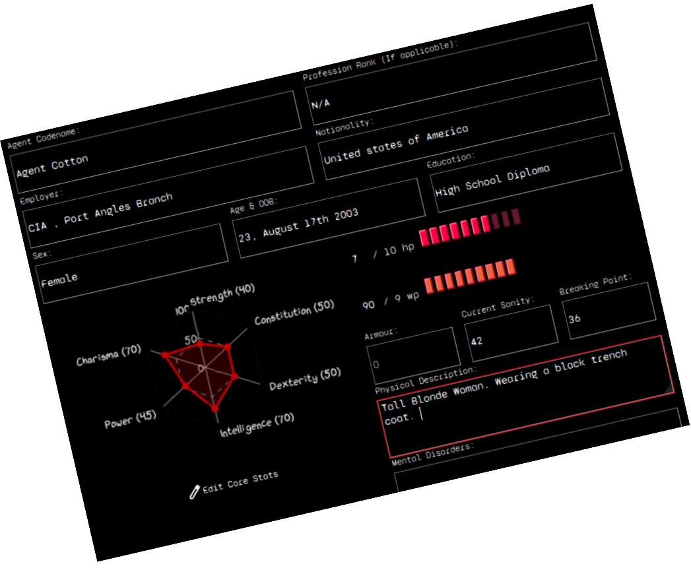
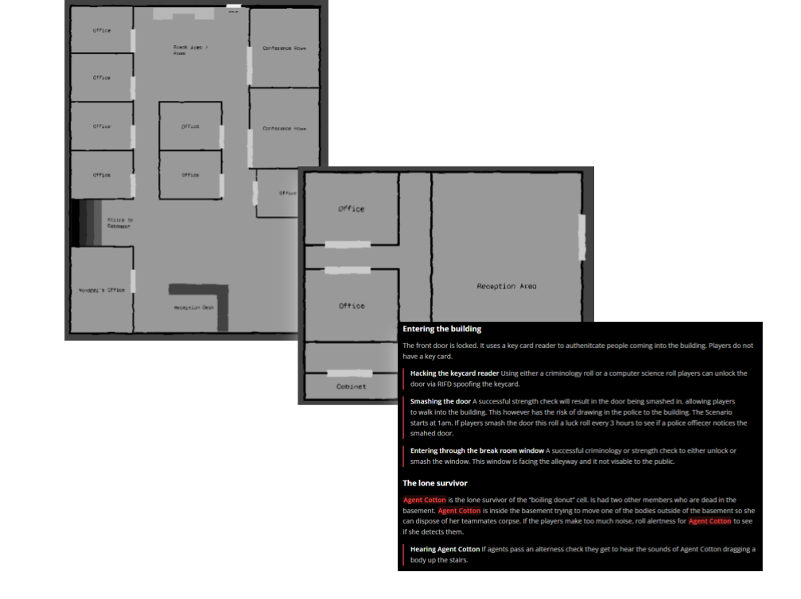

<!-- Hides the header information (So Obama can't see it). -->

    

    

**Redline** is a covert group inside the United States federal government. Its mission is to investigate, contain, and conceal unnatural events, because the unnatural is real and it kills. The world of Redline is like our own, but beyond the edges of reality are powers that outstrip the human mind’s capacity for understanding. Sometimes those powers bleed through into our world and destroy every- thing they touch. It is your job to identify, secure and destroy these excursions before they can harm people.

  

    <!-- <h3>Graphic / Image</h3>
    
Your left side content goes here.
 -->
    
  

  

    <h3>Create a Character!</h3>
    
Interactive character creator. Create a character and view it without making an account! 

    

        <a class="good-link" href="./Classes/Create-A-Character.html" >Create a Character →</a>
    

  

  

    <h3>Read the rulebook</h3>
    
Blah, Blah, Blah. All the good stuff that the DM's want to read. Don't worry, you have all the dice, and the rules are easy to understand, I promise. 

    

        <a class="good-link"  href="./Core Rules/Introduction.html" >Read Online Rulebook →</a>
    

  

  

    
  

  

    
  

  

    <h3>Made by Humans for humans</h3>
    
Generative AI was not used during the creative processes for making Redline. All source code and materials are open source and available at <a href="https://github.com/cbennington852/dnd_website" >GitHub</a>

    

        <a class="good-link" href="./free-missions/" >View Free Missions! →</a>
    

  

## Quick Links
Convenient Links for returning players
>[!danger]-  Classes
 >* [[Gunslinger]] 
> * [[Prepper]]
> * [[Close combat specialist]]
> * [[Slick Talker]]
> * [[Abomination]]

> [!danger]-  Home life options
> Throughout the day, the normal adult tends to have this thing called "free time". Typically they spend this time doing fun or relaxing things. Not you. As a secret agent you spend this time preparing for the next mission.
> * **Stay on the case:** Your agent remains on the case, researching unknown objects they have collected at the expense of their own sanity.
> * **Learn a new Skill:** Increase your skill in an area, roll INT, on a success Add 1d10 on a failure add 1d6.
> * **Restore Sanity:** Conduct some sort of sanity regaining activity. Roll Sanity, on success gain 1d10, on failure gain 1d4 sanity.
> * **Purchase Items:** Your Character purchases things, and items. (Look at rulebook page 88)

  <button onclick="window.location.href='./Classes/Create-A-Character.html';">       Create a Character</button>
  <button onclick="window.location.href='./Classes/Character-Sheet.html';">       View Character Sheet</button>

# Playtests

Redline was originally a homebrew campaign before it was published online. Below are mission reports from the original playtesters. Each table is a different group. Missions where players seemed to have the most fun are published as free missions for Redline.

    <a class="good-link" href="./free-missions/" >View Free Missions! →</a>

<!-- 
| Catagory                                                                                                                        | Description                                                                                                                                              |
| ------------------------------------------------------------------------------------------------------------------------------- | -------------------------------------------------------------------------------------------------------------------------------------------------------- |
| <html>   
Success
 </html>        | Mission went smoothly, monsters were slain, humans rescused. No major loss of life or cause for evacuation.                                              |
| <html>   
Resolved
 </html>        | Things didn't exactly go perfectly, however everyone made it out okay. You gotta break a few eggs to make an omelet after all.                           |
| <html>   
Unresolved
 </html>    | Something went wrong, civilians were lost, some sort of threat was left uncontained.                                                                     |
| <html>   
Critical Failure
 </html> | Massive present danger to society left unchecked. Agents actively made the situation worse or caused a major disaster. Further work needed to clean up.  | -->

## Team Ramen

| **Mission Name**    | **Description**                                                                                                                                   | **Result**                                                                                                      | **Status**                                                                                                                      |
| ------------------- | ------------------------------------------------------------------------------------------------------------------------------------------------- | --------------------------------------------------------------------------------------------------------------- | ------------------------------------------------------------------------------------------------------------------------------- |
| First things Last   | Redline friendly died several days ago of a heart attack. Sweep his apartment and remove any evidence of the the unnatural and Redline.   | Mission success, items contained, threats eliminated                                                            | <html>   
Success
 </html>        |
| Mayday , mayday     | A young child is found wandering through the woods. Face id's match them to a missing child case... from 45 years ago                             | Rangers killed, Child recovered                                                                                 | <html>   
Resolved
 </html>        |
| Train to no-where   | Late night call. A suspected Wizard was flagged to have boarded a train(east bound Epharata - > Spokane 1:23 am). Eliminate all un-natural.       | Wizard Killed via direct trauma to testicles. All passengers killed. Train was transported to unknown location. | <html>   
Resolved
 </html>        |
| A murder in red     | Crows have killed a Redline friendly; an surveyance researcher at oregon state university, agents dispatched to investigate. caution advised. | Anomaly unconfined. Agent blob was banned from oregon state university.                                         | <html>   
Critical Failure
 </html> |
| Cotton's Catastrophe      | Late night call, 1am. Another group of agents is in trouble. Get there as fast as possible. Recover the agents, eliminate all unnatural.          | Agent Cotton and briefcase recovered. Unattended interview job candidate was ducktaped to car front seat and driven into nearby bushed. Building demolished                                                                              | <html>   
Unresolved
 </html>    |
| Return to Sender I         | A local hunter group have made an unusual catch. Recover the specimen. Eliminate all traces of the unnatural.                                     | Cabela employees  harassed. Agents accidentally created a new ocean full of dinosaurs.                         | <html>   
Critical Failure
 </html> |
| Return to Sender II    | Agents travel back to the ocean that they accidentally created in the middle of the colordao desert.                                              | Full retreat necessary, multiple agents downed. Agent Lomen's shin was snapped in half by a  snapping turtle. | <html>   
Unresolved
 </html>    |
| Return to Sender III | Agents race to finish what they started.                                                                                                          | Agents return to Cabela's for more harassment. Ocean mostly drained. Bear suits worn.                           | <html>   
Success
 </html>        |
| Sketchway           | Agents are tasked with escorting Agent Cotton to pick up her medication from a local store.                                                       | Uncooked hotdogs and boner pills consumed. Homeless harassed. Hair exchanged for double phone.                  | <html>   
Unresolved
 </html>    |
| Sketchway II        | Agents attempt to escape "the store".                                                                                                             |                                                                                                                 |                                                                                                                                 |

## The White Monster Consumers

| **Mission Name**              | **Description**                                                                                                                                                                    | **Summary**                                                                                                                                                                               | **Result**                                                                                                                      |
| ----------------------------- | ---------------------------------------------------------------------------------------------------------------------------------------------------------------------------------- | ----------------------------------------------------------------------------------------------------------------------------------------------------------------------------------------- | ------------------------------------------------------------------------------------------------------------------------------- |
| **First things Last**         | Redline friendly died several days ago of a heart attack. Sweep his apartment and remove any evidence of the the unnatural and Redline.                                    | Mission success, items contained, threats eliminated                                                                                                                                      | <html>   
Success
 </html>        |
| **Walk in the Park**       | A young child is found wandering through the woods. Face id's match them to a missing child case... from 45 years ago                                                              | Brandon Recovered. Beer consumed. Medium conspiracy required. Park Rangers eviscerated.                                                                                                   | <html>   
Resolved
 </html>        |
| **Cotton's catastrophe**      | Late night call, 1am. Another group of agents is in trouble. Get there as fast as possible. Recover the briefcase, eliminate all unnatural.                                        | Briefcase in agent hands. Building rigged to blow. Epstein giant killed. Agent GPS tracker signal lost.                                                                                   | <html>   
Resolved
 </html>        |
| **Red Nest**                  | Agents investigate the underground structure they found previously. Recover the briefcase and agent cotton.                                                                        | Agent Cotton survived (somehow). Children rescued from "the diddy cave". Gooners slain. Building destroyed. Briefcase recovered.                                                          | <html>   
Success
 </html>        |
| **Red Alert**                 | A boring simple mission, to rest and relax after the hectic last missions. Retrieve a box from storage, and then transport it to the location.                                     | Players prevented assassination attempt on the handlers life. Improvised brain surgery performed. Bears intimidated.                                                                      | <html>   
Resolved
 </html>        |
| **Doomscrolling**             | A suspected Wizard was flagged to have boarded a Metro Bus (east bound Division 25 stop 3 @ 1:23 am). Bring him in alive.                                                          | Wizard recovered alive. Bus destroyed. Ad's endured.                                                                                                                                      | <html>   
Success
 </html>        |
| **The bird mission**          | A Redline friendly, Professor Parsons was killed yesterday at his workplace (Oregon state university). His research was primarily into birds. Contain the unnatural.           | Aviary destroyed. Birds charred. Civilians killed. Agent John accidentally hotboxed himself.                                                                                              | <html>   
Resolved
 </html>        |
| **Going shopping**            | Agents are tasked with getting agent cotton a haircut at the barbershop and converting a metal box into MP4 format.                                                                | North Korean APC acquired. Haircut successful. Agent Schnitzel was chewed on                                                                                                              | <html>   
Success
 </html>        |
| **Red Rat**                   | The Handler has located the traitor that exposed his location in a previous mission (Red Alert). Considered armed an extremely dangerous. Hunt the traitor down and eliminate him. | Traitor killed. Passenger ferry transported to unknown dimension. Over 85 innocent civilians killed or maimed. Unknown number of civilians trapped in unknown dimension. Train destroyed. | <html>   
Critical Failure
 </html> |
| **The good stuff**            | A bizarre mass murder involving fire occurred in Forks Washington. Investigate. Prevent this from happening again.                                                                 | Several drug addicts killed. One taken hostage. Bartender rizzed.                                                                                                                         | <html>   
Success
 </html>        |
| **The good stuff II**         | Agents pursue the cause of "the stuff"                                                                                                                                             | Agents saved by wizard. Threats neutralized. Agent John gained a pen pal.                                                                                                                 | <html>   
Success
 </html>        |
| **Wait, you look like me.**   | An independent lab was broken into last night. The main suspects are .... team monster drinkers?                                                                                   | Doppelgangers were either killed by the team or died via their own hands. Local police officer discovered his new sexuality.                                                              | <html>   
Success
 </html>        |
| **Wait, you look like me II** | The team travels back in time to tie up some loose ends                                                                                                                            | Agent Schnitzel and Agent John experienced friendly fire. Agent Schnitzel ate all of the eggs in the basket.                                                                              | <html>   
Success
 </html>        |
| **Code Red**                  | A mysterious fog has surrounded the town of Port Angles. Agents have two objectives, recover agent cotton and remove port angles.                                                  | Port angles destroyed with excessive force. Free bird played.                                                                                                                             | <html>   
Success
 </html>        |

## Team Boiling Donut

| **Mission Name**              | **Description**                                                                                                                                 | **Summary**                                                                                                                                                                       | **Status**                                                                                                                      |
| ----------------------------- | ----------------------------------------------------------------------------------------------------------------------------------------------- | --------------------------------------------------------------------------------------------------------------------------------------------------------------------------------- | ------------------------------------------------------------------------------------------------------------------------------- |
| **First things Last**         | Redline friendly died several days ago of a heart attack. Sweep his apartment and remove any evidence of the the unnatural and Redline. | Mission success, items contained, threats eliminated                                                                                                                              | <html>   
Success
 </html>        |
| **Hospital Incident**         | Agents are called to investigate reports of vampires at the Ohio state hospital.                                                                | Severe structural damage. Government required to step in and control situation. Several civilian deaths.                                                                          | <html>   
Critical Failure
 </html> |
| **No refunds**                | Agents investigate a strange amazon package.                                                                                                    | Agent Pine in critical condition. Building declared to have a gas leak; terrorist and unnatural force neutralized. Cover story used. Target killed. Unnatural presence contained. | <html>   
Resolved
 </html>        |
| **Field Trip**                | Agents investigate reports of a strange humming statue located on MIT campus.                                                                   | Multiple structures destroyed, 150 civilians affected. Anomaly unconfined. Agent W killed.                                                                                        | <html>   
Critical Failure
 </html> |
| **A typical day in New York** | Agents investigate swarms of rats ripping new yorkers to shreds.                                                                                | Photograph cursed agent, requiring high-level intervention. No public knowledge. Containment successful through internal ops.                                                     | <html>   
Unresolved
 </html>    |
| **Pawn E4**                   | Bizarre murders, with a jade statue being left as a calling card.                                                                               | Artifact was anomalous and deadly. Contained with minimal exposure. Statue mistaken for jesus.                                                                                    | <html>   
Resolved
 </html>        |
| **Vapour Trails**             | Small town USA, multiple townspeople killed via a large animal. Massive three toes footprints left in the sand.                                 | Dinosaurs... agent white has been eaten. Unhealthy amounts of deep fried dinosaur consumed.                                                                                       | <html>   
Success
 </html>        |
| **Do you smell something?**   | A chemical laboratory located in Montana has mysteriously exploded. Officials ruled it a suicide.                                               | Investigation into terrorist apartment revealed giant ants. Situation handled without wider exposure. Anomaly neutralized.                                                        | <html>   
Success
 </html>        |
| **Flesh Town Incident**       | Sibling organization reports town infected with flesh-like growths. Dispatched "special" forces.                                                | Growths neutralized. Only one fatality; agent suicide.                                                                                                                            | <html>   
Success
 </html>        |
| **Holy Item Recovery**        | An holy relic was stolen from the vatican. Agents dispatched to recover holy item and hostage.                                                  | Artifact destroyed. Hostage eliminated.                                                                                                                                           | <html>   
Success
 </html> |
